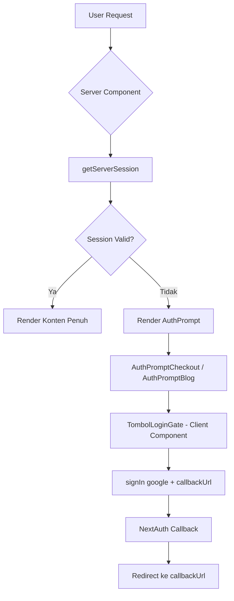

# Design Document: Auth Gate

## Overview

Auth Gate adalah mekanisme perlindungan akses pada aplikasi Next.js **Ruang Seduh** yang memastikan halaman-halaman tertentu hanya dapat diakses oleh pengguna yang sudah login. Fitur ini diimplementasikan menggunakan **React Server Components (RSC)** dan **NextAuth.js v4** yang sudah ada di aplikasi.

Dua area yang dilindungi:
- **`/checkout`** — Bebas dijelajahi (toko + keranjang), tapi wajib login untuk menyelesaikan checkout.
- **`/blog/[slug]`** — Daftar blog bebas diakses, tapi konten artikel penuh wajib login.

Pendekatan yang dipilih adalah **Server-Side Gate** menggunakan `getServerSession` di dalam Server Component, bukan Next.js Middleware. Ini dipilih karena:
1. Setiap halaman yang dilindungi membutuhkan data kontekstual berbeda untuk ditampilkan di Auth Prompt (data artikel untuk blog, data cart untuk checkout).
2. Middleware tidak memiliki akses ke data Sanity atau Zustand store.
3. Konsisten dengan pola yang sudah digunakan di `app/blog/[slug]/page.tsx`.

---

## Architecture



**Alur data:**
1. Request masuk ke Server Component halaman yang dilindungi.
2. Server Component memanggil `getServerSession(authOptions)`.
3. Jika session ada → render konten normal.
4. Jika session tidak ada → render komponen `AuthPrompt` yang sesuai, dengan data kontekstual (judul artikel / ringkasan cart).
5. `AuthPrompt` merender `TombolLoginGate` (Client Component) yang memanggil `signIn("google", { callbackUrl })`.
6. Setelah login berhasil, NextAuth mengarahkan user ke `callbackUrl`.

---

## Components and Interfaces

### 1. `AuthPromptBlog` (Server Component)

Ditampilkan di `app/blog/[slug]/page.tsx` ketika guest mengakses halaman detail artikel.

```typescript
interface AuthPromptBlogProps {
  title: string;        // Judul artikel
  imageUrl?: string;    // URL gambar sampul artikel
  slug: string;         // Slug artikel untuk callbackUrl
}
```

Menampilkan: judul artikel, gambar sampul (preview), pesan kontekstual, dan `TombolLoginGate`.

### 2. `AuthPromptCheckout` (Server Component)

Ditampilkan di `app/checkout/page.tsx` ketika guest mengakses halaman checkout.

```typescript
interface AuthPromptCheckoutProps {
  callbackUrl: string;  // "/checkout"
}
```

Menampilkan: ringkasan item cart (diambil dari client via `useCartStore`), pesan kontekstual, dan `TombolLoginGate`.

> **Catatan:** Karena data cart disimpan di Zustand (client-side), `AuthPromptCheckout` perlu menjadi Client Component atau menggunakan sub-komponen client untuk membaca cart.

### 3. `TombolLoginGate` (Client Component)

Tombol login yang dapat digunakan kembali oleh kedua Auth Prompt.

```typescript
interface TombolLoginGateProps {
  callbackUrl: string;  // URL tujuan setelah login berhasil
  label?: string;       // Default: "Masuk dengan Google"
}
```

Memanggil `signIn("google", { callbackUrl })` saat diklik.

### 4. Modifikasi `app/checkout/page.tsx`

Halaman checkout diubah dari Client Component menjadi **Server Component** (wrapper). Server Component mengecek session, lalu:
- Jika tidak ada session → render `AuthPromptCheckout`.
- Jika ada session → render `CheckoutForm` (Client Component yang berisi logika form yang sudah ada).

### 5. Modifikasi `app/blog/[slug]/page.tsx`

Logika gate ditambahkan di awal fungsi page yang sudah ada:
- Jika tidak ada session → fetch data artikel minimal (judul + gambar) → render `AuthPromptBlog`.
- Jika ada session → lanjutkan render normal seperti sekarang.

---

## Data Models

Tidak ada perubahan skema database. Fitur ini sepenuhnya bergantung pada:

- **`Session`** dari NextAuth (sudah ada di `lib/auth.ts`)
- **`CartItem`** dari Zustand store (sudah ada di `store/useCartStore.ts`)
- **Data artikel** dari Sanity (sudah ada, hanya diambil sebagian untuk Auth Prompt)

```typescript
// Tipe data minimal untuk Auth Prompt Blog
interface BlogPostPreview {
  title: string;
  mainImageUrl?: string;
}

// Tipe data item cart (sudah ada di useCartStore)
interface CartItem {
  id: string;
  name: string;
  price: number;
  quantity: number;
  image: string;
}
```

---

## Correctness Properties

*A property is a characteristic or behavior that should hold true across all valid executions of a system — essentially, a formal statement about what the system should do. Properties serve as the bridge between human-readable specifications and machine-verifiable correctness guarantees.*

### Property 1: Gate memblokir semua guest dari halaman yang dilindungi

*For any* request tanpa session yang valid ke halaman `/checkout` atau `/blog/[slug]`, fungsi gate check harus mengembalikan hasil "blocked" (tidak mengizinkan akses ke konten penuh).

**Validates: Requirements 2.1, 4.1**

### Property 2: Gate mengizinkan semua authenticated user ke halaman yang dilindungi

*For any* request dengan session NextAuth yang valid ke halaman `/checkout` atau `/blog/[slug]`, fungsi gate check harus mengembalikan hasil "allowed" (mengizinkan akses ke konten penuh).

**Validates: Requirements 2.4, 4.4**

### Property 3: CallbackUrl selalu mencerminkan path yang diakses

*For any* path halaman yang dilindungi (misalnya `/checkout` atau `/blog/[slug]`), callbackUrl yang dihasilkan oleh Auth Prompt harus sama persis dengan path tersebut, sehingga user selalu diarahkan kembali ke halaman yang benar setelah login.

**Validates: Requirements 2.2, 4.2**

### Property 4: Fallback redirect ke halaman utama untuk callbackUrl tidak valid

*For any* callbackUrl yang tidak valid (null, undefined, string kosong, atau URL eksternal yang tidak diawali `/`), fungsi validasi redirect harus mengembalikan `"/"` sebagai fallback, sehingga user tidak pernah diarahkan ke URL berbahaya atau error.

**Validates: Requirements 6.2**

### Property 5: Auth Prompt Blog selalu menampilkan data artikel yang diberikan

*For any* data artikel yang valid (dengan judul dan URL gambar), komponen `AuthPromptBlog` harus merender judul artikel tersebut dalam output-nya, sehingga guest selalu mengetahui konten apa yang akan mereka dapatkan setelah login.

**Validates: Requirements 4.5**

### Property 6: TombolLoginGate selalu meneruskan callbackUrl ke signIn

*For any* callbackUrl yang valid, memanggil handler login pada `TombolLoginGate` harus memanggil `signIn("google", { callbackUrl })` dengan callbackUrl yang sama persis, sehingga tidak ada informasi redirect yang hilang.

**Validates: Requirements 5.3**

---

## Error Handling

| Skenario | Penanganan |
|---|---|
| Session expired saat di halaman yang dilindungi | Next.js akan re-render server component, session akan null, Auth Prompt ditampilkan |
| Login dibatalkan oleh user | NextAuth mengarahkan ke halaman sebelumnya (default behavior), tidak ada error ditampilkan |
| Login gagal (error OAuth) | NextAuth mengarahkan ke `/api/auth/error`, halaman error default NextAuth |
| Artikel tidak ditemukan di Sanity | Halaman 404 tetap ditampilkan (tidak berubah dari behavior saat ini) |
| callbackUrl tidak valid / eksternal | Fungsi validasi mengembalikan `"/"` sebagai fallback (Property 4) |
| Cart kosong saat di checkout | Behavior sudah ada: redirect ke `/toko` (tidak berubah) |

---

## Testing Strategy

### Pendekatan Dual Testing

Fitur ini menggunakan kombinasi **unit tests** dan **property-based tests**:

- **Unit tests**: Memverifikasi contoh spesifik, edge case, dan integrasi komponen.
- **Property tests**: Memverifikasi properti universal yang harus berlaku untuk semua input.

### Library

- **Property-based testing**: [`fast-check`](https://fast-check.io/) — library PBT untuk TypeScript/JavaScript.
- **Unit testing**: `vitest` + `@testing-library/react`.
- **Mocking**: `vi.mock` untuk `next-auth/react` dan `next-auth`.

### Konfigurasi Property Tests

Setiap property test dijalankan minimum **100 iterasi** (default fast-check).

Tag format: `// Feature: auth-gate, Property {N}: {deskripsi singkat}`

### Rencana Test

#### Property Tests (fast-check)

```
// Feature: auth-gate, Property 1: gate blocks all guests from protected pages
test("gate memblokir semua guest") - generate berbagai state session tidak valid
  → checkGate(null) === "blocked"
  → checkGate(undefined) === "blocked"
  → checkGate({ expired: true }) === "blocked"

// Feature: auth-gate, Property 2: gate allows all authenticated users
test("gate mengizinkan semua authenticated user") - generate berbagai session valid
  → checkGate({ user: { id: anyString } }) === "allowed"

// Feature: auth-gate, Property 3: callbackUrl matches accessed path
test("callbackUrl mencerminkan path yang diakses") - generate berbagai path valid
  → buildCallbackUrl("/checkout") === "/checkout"
  → buildCallbackUrl("/blog/" + anySlug) === "/blog/" + anySlug

// Feature: auth-gate, Property 4: invalid callbackUrl falls back to "/"
test("fallback ke / untuk callbackUrl tidak valid") - generate berbagai nilai tidak valid
  → validateCallbackUrl(null) === "/"
  → validateCallbackUrl("https://evil.com") === "/"
  → validateCallbackUrl("") === "/"

// Feature: auth-gate, Property 5: AuthPromptBlog renders article title
test("AuthPromptBlog merender judul artikel") - generate berbagai data artikel
  → render(<AuthPromptBlog title={anyTitle} />) contains anyTitle

// Feature: auth-gate, Property 6: TombolLoginGate passes callbackUrl to signIn
test("TombolLoginGate meneruskan callbackUrl") - generate berbagai callbackUrl valid
  → click button → signIn called with { callbackUrl: anyValidUrl }
```

#### Unit Tests (contoh spesifik)

```
test("halaman /toko dapat diakses tanpa session")
test("halaman /blog dapat diakses tanpa session")
test("AuthPromptCheckout merender tombol Masuk dengan Google")
test("AuthPromptBlog merender tombol Masuk dengan Google")
test("checkout page menampilkan AuthPrompt ketika tidak ada session")
test("checkout page menampilkan form checkout ketika ada session")
test("blog detail page menampilkan AuthPrompt ketika tidak ada session")
test("blog detail page menampilkan konten artikel ketika ada session")
```

#### Integration Tests

```
test("setelah login dari /checkout, user diarahkan ke /checkout")
test("setelah login dari /blog/[slug], user diarahkan ke /blog/[slug] yang sama")
```
